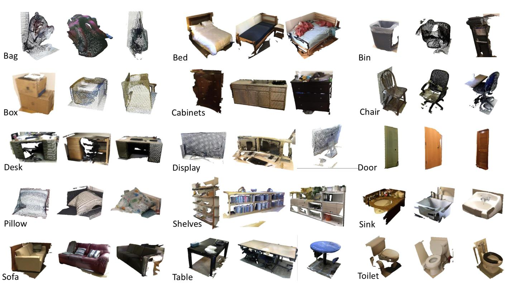

## **CS 4644/7643: Deep Learning | Spring 2023**
**Georgia Institute of Technology, Atlanta, GA**

Final project by,

>*Devashish Gupta*: devashish-gupta@gatech.edu\
>*Divyaansh Singh*: dsingh313@gatech.edu\
>*Sanjay Josh*: sjosh3@gatech.edu\
>*Vastav Bharambe*: vbharambe6@gatech.edu

Refer to `driver.ipynb` for all the main sections

# **Point Cloud Classification**

#### **Introduction**
Point cloud data is an important type of data used in various applications such as autonomous vehicles, robotics, and virtual reality. Point cloud classification refers to the task of assigning a label to a given point cloud based on its features.

#### **Dataset**
In this notebook, we will be using the ModelNet40 dataset for testing our models. ModelNet10 is a widely-used benchmark dataset for evaluating 3D object classification algorithms. It contains 12,311 CAD models from 10 different categories, with each model represented as a point cloud.

#### **Models**
We will be implementing and comparing three different models for point cloud classification: SimpleView, 3DCTN, and a modified custom version of 3DCTN. SimpleView is a simple yet effective model that uses a fully connected network to classify point clouds. 3DCTN, on the other hand, is a more complex model that uses a 3D convolutional neural network (CNN) to classify point clouds. We will also be modifying the 3DCTN model to see if we can improve its performance.

#### **Adversarial attacks and visualization**
Additionally, we will also be testing each model against adversarial attacks, including one-point attacks and imperceptible noise addition attacks, to evaluate their robustness.

